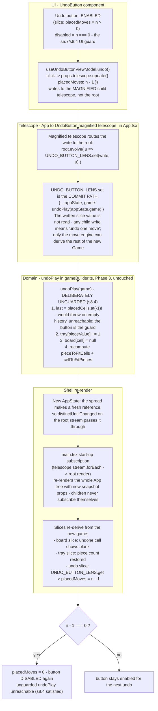

# Phase 10 — how a single Undo click flows

Vertical trace of one enabled undo click, through the four layers it
touches: the `UndoButton` component, the App → `UndoButton` magnified
telescope, the Phase 3 move engine, and the shell re-render.

